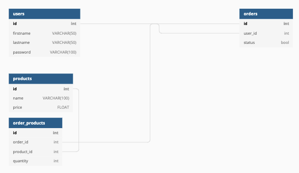

# Storefront Backend Documentation

From a high-level view, this is the documentation for the backend for the storefront written in TypeScript using a PostgresSQL backend.

## Overview

The project uses Express to provide a CRUD API for creating orders, users and products which are stored in a PostgreSQL backend. JWTs are used to provide authorisation and authentication.

# Project Setup

The structure of the project is straightforward with a few key files and folders to be aware of:

- `.env` - your configuration file to store all your sensitive information (make sure to add it to your `.gitignore`)

- `server.ts` - Configures Express for the project

- `database.ts` - Takes the sensitive information from `.env` and sets up the DB connection

- `/src` - Main project folder for the TypeScript files

- `/src/models` - Contains the models (functions for interacting with the DB) for orders, products and users

- `/src/handlers` - Contains the Express endpoints that call the models and provide the CRUD functionality

- `/src/tests` - Unit and integration tests for the project

- `/migrations` - Database migrations for creating and destroying the databases while testing and setting up for use

- `/dist` - Output folder for the compiled TypeScript

# Useful Commands

-`npm run test` - Runs the tests as the test user on the test database
-`npm run lint` - Formats the files and checks with ESLint and Prettier
-`npm run tsc`- Compiles the TypeScript
-`npm run start` - Starts a local server running on port 3000 for you to run queries against the endpoints

# Restful Endpoints

## Orders

 - `GET` /orders --> Returns list of all orders
 - `GET` /orders:id --> Returns specific order by ID
 - `POST` /orders --> Creates a new order
 - `PUT` /orders --> Updates an order
 - `POST` /order/:id/products --> Used for adding products to an order
 - `GET` /order/products --> Returns order_products table
 - `DELETE` /order/:id/products --> Deletes products from an order 
 - `DELETE` /orders/:id --> Deletes an order

 ## Products

 - `GET` /products --> Returns all products
 - `GET` /products/:id --> Returns product by specific ID
 - `POST` /products --> Creates a new product
 - `PUT` /products --> Updates a product
 - `DELETE` /products --> Deletes a product by ID

## Users

 - `GET` /users --> Returns all users
 - `GET` /users/:id --> Returns user by specific ID
 - `POST` /users --> Creates a new user
 - `PUT` /users --> Updates a user
 - `POST` /users/auth --> Authenticates a user
 - `DELETE` /users --> Deletes a user by ID

# Postman Testing

To help you further with testing, here is a link to a collection of endpoint tests that you can use with your development: [Postman Collection](https://go.postman.co/workspace/My-Workspace~964c436f-4ff5-473a-83eb-d19b0916e567/collection/17944040-1dcbb585-c58d-4c75-9efd-865d3685578e)

## JWT For Testing

When running the test command `npm run test`, a JWT is created and passed to the handler tests but it is also logged to the console when the tests begin and can be used for independently testing with Postman

 # Database Schema

 A picture says a thousand words. Below is an image of the database schema. To modify it, please edit the database migrations

The schema was created with: [dbdiagram.io](https://dbdiagram.io/)

## Data Shapes

## Data Shapes

### Product

- id 
- name 
- price 

### User

- id
- firstname
- lastname
- password

### Orders

- id
- user_id
- status
- product_id
- quantity